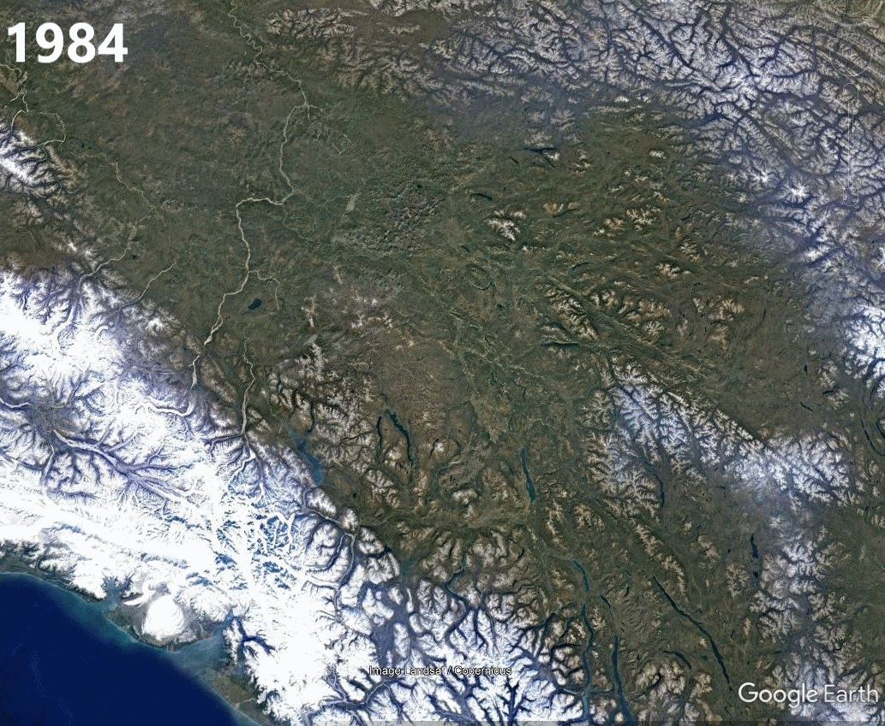



Natural Language Processing for Biological Information Retrieval
======
Biodiversity information is stored in various physical forms including a large body of published peer-reviewed and interest literature (field guides, pamphelts, etc.). Unfortunately, much of this information has yet to be
extracted from these resources, leading to a deficiency in data regarding species distributions, biological interactions, and traits. Tools in machine learning and computational linguistics can help us identify, classify, and
extract this information for downstream use. 

Ecological Knowledge Organization & Distribution
======
Information extracted from literature needs to be standardized and represented in ways that are meaningful for analysis and interpretation. I am interested in how to represent complex natural language data as potential variables
for analysis, including the representation of complex traits such as habitat by biotic/abiotic qualities.

High-latitude Butterfly Ecology & Evolution
======
High-latitude, subarctic and arctic habitats are increasingly threatened by climate change at a rate far faster than other regions. Understanding the evolution of buterfly lineages into these challenging habitats and predicting 
their responses to climate change will be critical for identifying potential refugia and developing conservation priorities.

